# Captain Spoon - recipe app

This is a full-stack Django, PostgreSQL and React with Docker recipe app inspired by [Jonas Schedtmann's](https://github.com/jonasschmedtmann) Forkify App. Checkout [my own implementation of this app from course](https://github.com/rafalbodanka/forkify-app) too.

Look for your favourite recipes, bookmark them and gather your own recipes.

## Table of Contents

- [Installation](#installation)
- [Installation with Docker Compose](#installation-with-docker-compose)
- [Usage](#usage)
- [Configuration](#configuration)
- [Credits](#credits)

## Installation

### Backend

1. Make sure you have PostgreSQL installed and running on your system.
2. Open a terminal and navigate to the `backend` folder.
3. Create virtual environment:

   ```bash
   python -m venv venv
   ```

4. Install the required dependencies by running the following command:

   ```bash
   pip install -r requirements.txt
   ```

5. Create a .env file in the backend folder and specify the Django SECRET_KEY. Look at [Configuration](#configuration) for more details.

6. Run migrations:

   ```bash
   python manage.py makemigrations
   python manage.py migrate
   ```

7. Start the backend server by running the following command:

   ```bash
   python manage.py runserver
   ```

### Frontend

1. Open a new terminal and navigate to the frontend folder.
2. Install the required dependencies by running the following command:

   ```bash
   npm install
   ```

3. Start the development server by running the following command:

   ```bash
   npm start
   ```

## Installation with Docker Compose

1. Make sure you have Docker and Docker Compose installed on your system.
2. Navigate to the project root folder.
3. Create a .env file in the backend folder and specify the Django SECRET_KEY. Look at [Configuration](#configuration) for more details.
4. Build and start the containers using Docker Compose:

   ```bash
   docker compose up --build
   ```

This command will build the Docker images for the backend and frontend, and start the containers.

Migrate django models to your database. You can do it in two ways:

1. In container's built-in Docker terminal:

   ```
   python manage.py makemigrations
   python manage.py migrate
   ```

2. Default terminal:

   ```
   docker exec -it your-backend-app-container-ID-from-Docker python manage.py makemigrations
   docker exec -it your-backend-app-container-ID-from-Docker python manage.py migrate
   ```

Once both the backend and frontend servers are running, you should be able to access the app in your web browser at http://localhost:3000. The backend should be running at http://localhost:8000.

## Usage

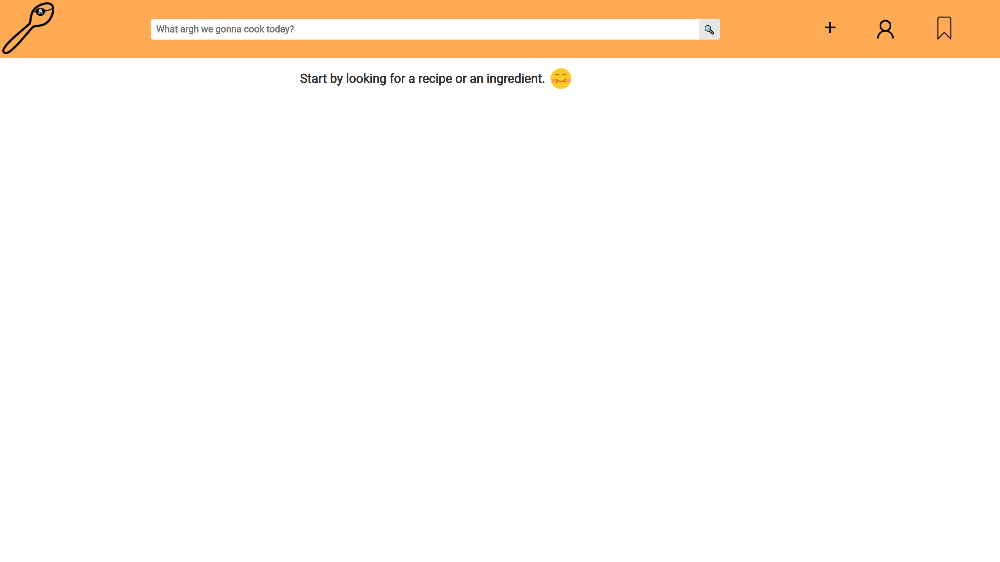

Look for your favourite recipes.

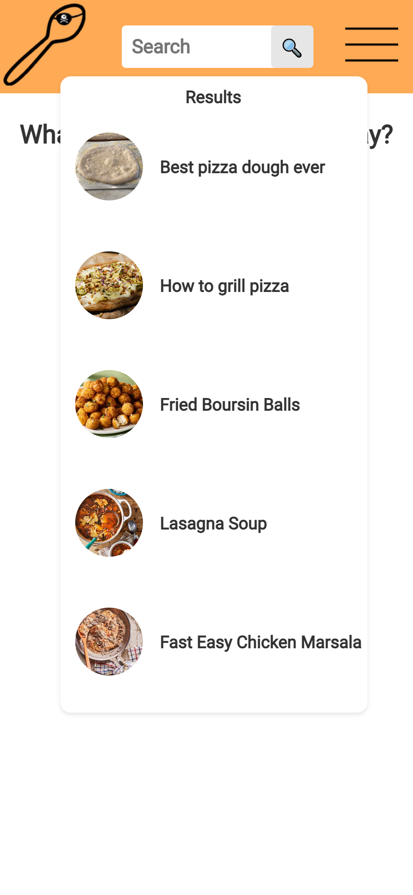

Check the details of a recipe.

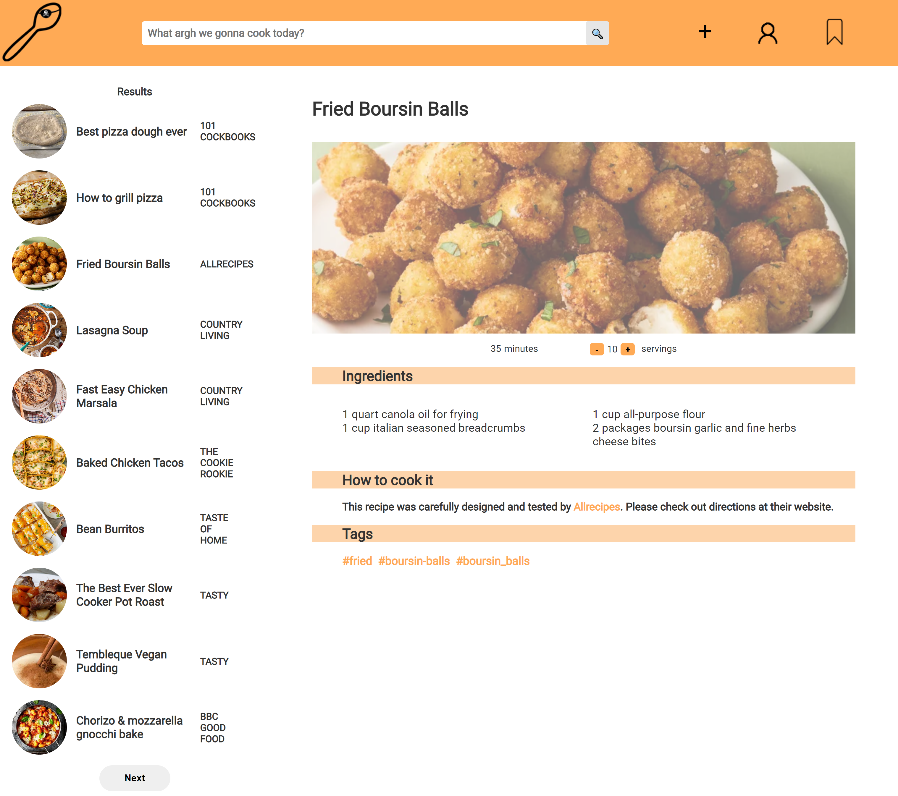
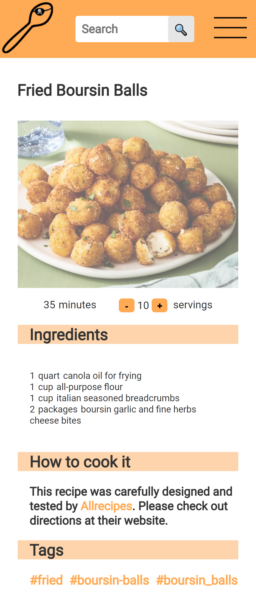

Create your own account to bookmark and add your own recipes.

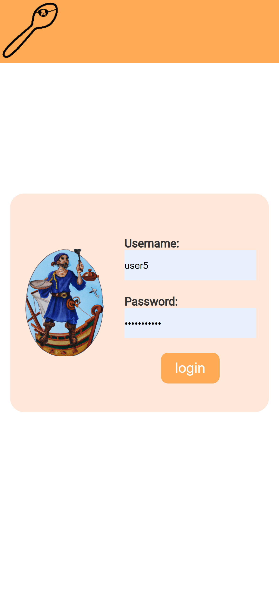
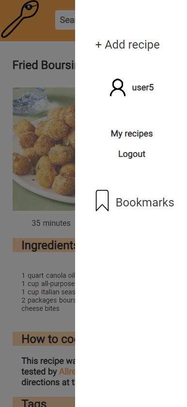

Bookmark your favourites.

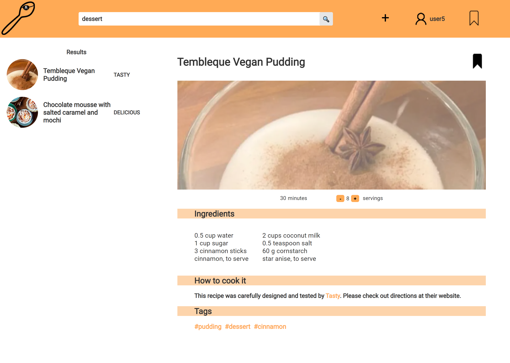

Search through your bookmarks.

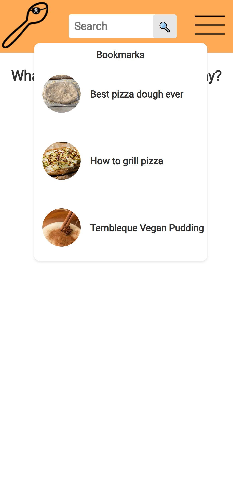

Add your own recipe.

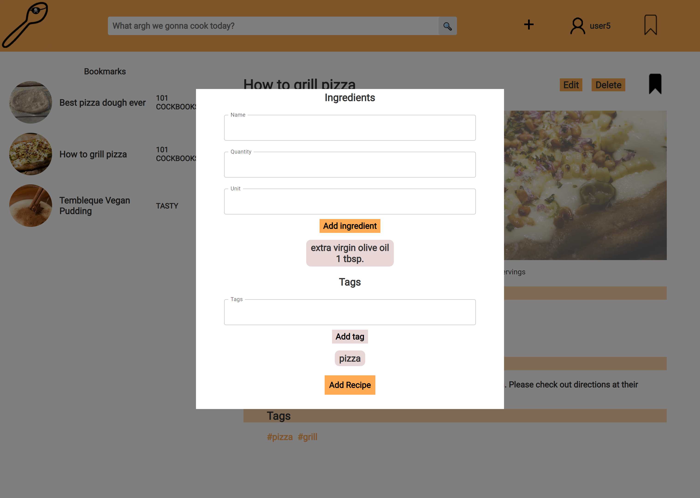

Search through your recipes.

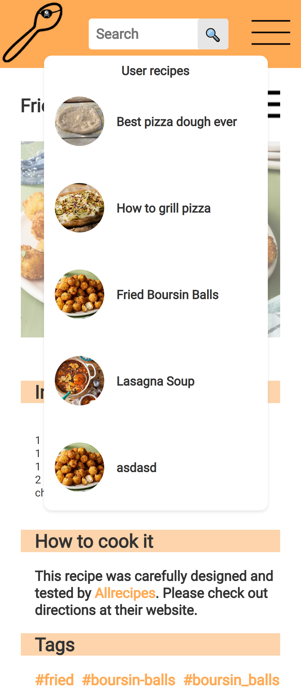

Control your recipes.

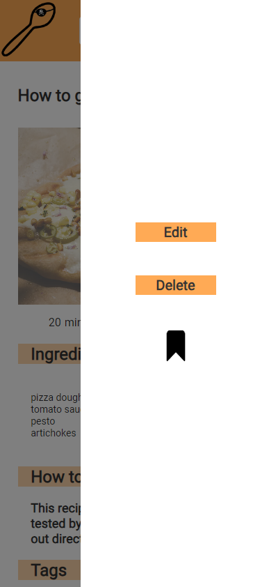
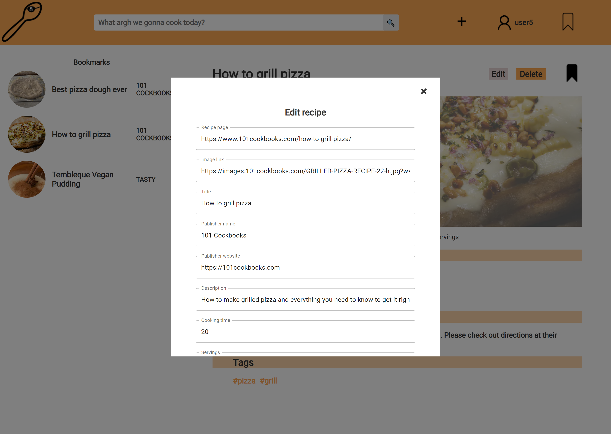

## Configuration

In order for the application to work properly you have to set SECRET_KEY variable for session encryption.

For environment variables 'decouple' package is used.

Open the .env file and add the environment variable in the following format:

SECRET_KEY='your_session_secret_here'

## Credits

This project utilizes most of all the following libraries, frameworks, and resources:

### Global

[Docker](https://www.docker.com/): A software framework for building, running, and managing containers on servers and the cloud.

### Backend

- [Django](https://www.djangoproject.com/): A high-level Python web framework that enables rapid development of secure and scalable server-side applications.
- [DRF](https://www.django-rest-framework.org/): A powerful and flexible toolkit for building Web APIs in Django, providing serialization, authentication, permissions, and more.
- [PostgreSQL](https://www.postgresql.org/): A powerful open-source relational database management system known for its robustness, extensibility, and performance.
- [simpleJWT](https://django-rest-framework-simplejwt.readthedocs.io/en/latest/): A library for providing JWT (JSON Web Token) authentication in Django Rest Framework, allowing secure user authentication and authorization in API endpoints.

### Frontend

- [React](https://reactjs.org/): A JavaScript library for building user interfaces.
- [Axios](https://axios-http.com/): A promise-based HTTP client for making API requests.
- [SASS](https://sass-lang.com/): CSS preprocessor providing more efficient and maintainable features than standard CSS.
- [MUI](https://mui.com/): A popular open-source UI framework for React applications that provides a set of pre-designed, customizable, and responsive components following the Material Design guidelines.

Please refer to the documentation or official websites of these resources for more information on how they were used in this project.
